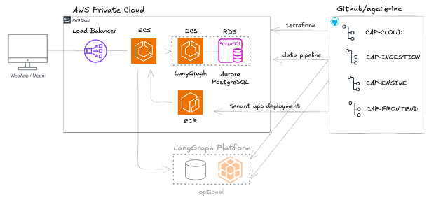

# CAP Cloud Community Version

CAP (Core AI Platform) is an end-to-end solution to configure and deploy AI agents. This version is free for personal use as well as for research. It provides core functionality for cloud infrastructure management and automation, serving as a starting point for users that seek a secure, flexible, and scalable entry into agentic AI development using AWS and LangGraph.

## Architecture Overview



## Other Components needed to run CAP

### 1. CAP Ingestion
The ingestion service is your starting point. The quality of ingested data is crucial for CAP's performance.
- Repository: [CAP INGESTION](https://github.com/Agaile-com/cap-ingestion-community)
- Note: Requires LangGraph account - [Sign up here](https://langchain.com/langgraph)

### 2. CAP Engine
The core processing engine for your cloud infrastructure.
- Repository: [CAP ENGINE](https://github.com/Agaile-com/cap-engine-community)
- Deploy as ENGINE on AWS or ENGINE-Lite on [Langsmith Platform](https://smith.langchain.com/)

### 3. CAP Frontend
The user interface component levaraging the assitent-ui library, purpose built for AI agents.
- Repository: [CAP FRONTEND](https://github.com/Agaile-com/cap-frontend-community)


## CAP Cloud Installation

### Prerequisites
- [Cursor.com (AI code editor)](https://www.cursor.com/)
- [AWS Account](https://aws.amazon.com/)
- [Langsmith Platform](https://smith.langchain.com/)
- Git
- Shell environment (Bash/Zsh)

### Quick Start
```bash
# Clone the repository
git clone https://github.com/Agaile-com/cap-cloud-community-repo.git
cd cap-cloud-community-repo

# Run the deployment script
./scripts/deploy-community.sh
```

## Documentation
Find detailed guides in the `/docs` directory:
- Setup Guide
- Usage Instructions
- API Reference
- Contributing Guidelines

## Community & Support
- 🐛 [GitHub Issues](https://github.com/Agaile-com/cap-cloud-community-repo/issues) - Bug reports & feature requests
- 💬 [Discussions](https://github.com/Agaile-com/cap-cloud-community-repo/discussions) - Questions & community support
- 📚 [Wiki](https://github.com/Agaile-com/cap-cloud-community-repo/wiki) - Additional documentation

## Contributing
We welcome community contributions! See our [Contributing Guide](CONTRIBUTING.md) for:
- Code of Conduct
- Development Process
- Pull Request Guidelines

## Related Resources
- [CAP Cloud Documentation](https://docs.cap-cloud.com)
- [Community Plugins](https://plugins.cap-cloud.com)

## Status
[](https://github.com/Agaile-com/cap-cloud-community-repo/actions)

## License
This project is licensed under the MIT License - see the [LICENSE](LICENSE) file for details.
